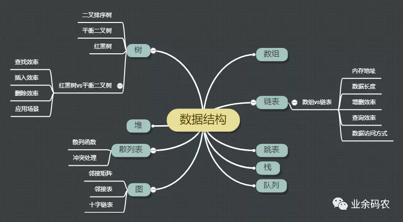

<!--
 * @Date        : 2020-11-08 15:37:39
 * @LastEditors : anlzou
 * @Github      : https://github.com/anlzou
 * @LastEditTime: 2020-11-08 15:44:09
 * @FilePath    : \data-structure\chapters\chapter01-introduction\nine-data-structure-diagrams.md
 * @Describe    : 
-->

有道笔记：[图解！24张图彻底弄懂九大常见数据结构](http://note.youdao.com/noteshare?id=0ad0b6aee579bd08cb9d46a007d24a9a&sub=A4D223A7CB9143939BE1AC3682922744)
