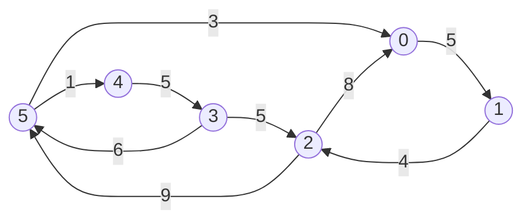

<!--
 * @Date        : 2020-05-21 17:12:42
 * @LastEditors : anlzou
 * @Github      : https://github.com/anlzou
 * @LastEditTime: 2020-05-24 22:24:31
 * @FilePath    : \data-structure\chapters\chapter08-graph\test-1.md
 * @Describe    : 
--> 

## 题目地址
8.1 验证性实验

## 题目描述
实验题 1：实现图的邻接矩阵和邻接表存储

目的：
```
领会图的两张主要存储结构和图基本运算算法设计。
```
函数：
```java
CreateMat(MatGraph &g, int A[MAXV][MAXV], int n, int e)   //由边数组A、顶点数 n 和边数 e 创建图的邻接矩阵 g 

DispMat(MatGraph g)       //输出邻接矩阵 g

CreateAdj(MatGraph *&G, int A[MAXV][MAXV], int n, int e)   //由边数组 A、顶点数 n 和边数 e 创建图的邻接表 G

DispAdj(AdjGraph *G)      //输出邻接表 G

DestroyAdj(AdjGraph *&G)  //销毁图的邻接表 G
```

图8.1 一个带权的有向图


## 图的定义
无论多复杂的的图都是由顶点和边构成的。采用形式化的定义，<p style="color:pink">图 (graph)G 由两个集合 V(vertex) 和 E(edge) 组成，记为<code> G = (V, E) </code>，其中 V 是顶点的有限集合，记为<code> V(G) </code>，E是连接 V 中两个不同顶点（顶点对）的边的有限集合，记为<code> E(G) </code>。</p>

### [邻接矩阵](https://baike.baidu.com/item/%E9%82%BB%E6%8E%A5%E7%9F%A9%E9%98%B5/9796080?fr=aladdin)
图的**邻接矩阵**(adjacency matrix)是一种采用邻接矩阵数组表示顶点之间相邻关系的存储结构。

### [邻接表](https://www.jianshu.com/p/ce4109962031)
图的**邻接表**(adjacency list)是一种顺序与链式存储相结合的存储方法。

## 代码
> - [struct.h](./code/struct/struct.h)
>>- [exp8-1.cpp](./code/exp8-1.cpp)
>>- [test1.cpp](./code/test1.cpp)

## 复杂度分析

- 时间复杂度：O( )
- 空间复杂度：O( )